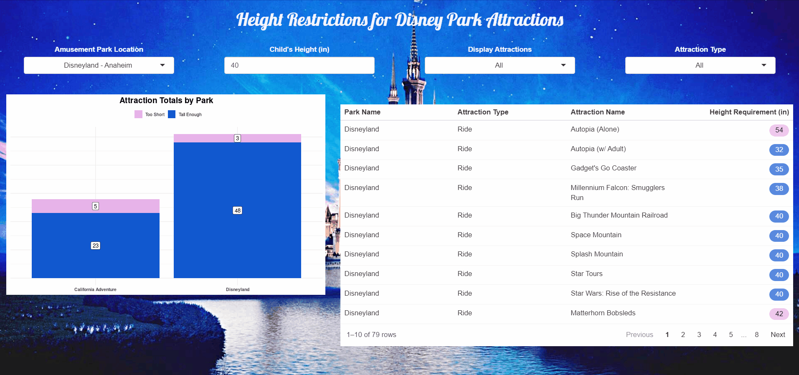

# Height Restrictions at Disney Parks | A Shiny App

Plan your Disney Amusement Park visit by analyzing attraction height restrictions affecting your group members.

## Description

Planning a visit to a Disney Amusement Park is a thrilling experience, often dominated by travel details with too little consideration for how a group's little 
one's will be able to participate in the attractions. With the help of this 
[Disney Height Restrictions](https://adambushman.shinyapps.io/disney-attractions-height-restrictions/) tool, you can quickly incorporate attraction height 
restrictions for your group members into your visit plans.

Each amusement park is reviewed regularly to include new attractions and remove those retired by the staff. Note that attraction availability and other 
attributes (i.e. accessibility) should be consulted with Disney Amusement Park websites directly.

### Attribution
Created by Adam Bushman, 2022
Twitter: [adam_bushman](https://twitter.com/adam_bushman)
GitHub: [adambushman](https://github.com/adambushman)
Portfolio: [adam-bushman.com](https://www.adam-bushman.com)

### Features

- Analyze height restrictions for every Disney Amusement Park location:
  - Disneyland, Anaheim
  - Disney World, Orlando
  - Disneyland, Paris
  - Disneyland, Tokoyo
  - Disneyland, Hong Kong
  - Disneyland, Tokoyo
- Visualize how many attractions in which a child may participate by their height (in) and each park
- Review the attractions by name, park, and the height restriction in a sortable, paginated table
- Adjust the child's height as desired
- Filter for attractions by their type (i.e. ride) or by a child's qualification for the attractions (via their height)

### Development

This app was created using the R programming language, leveraging a handful of packages to power the computing, markup, interactivity, and the hosting.
Below you'll find a list of the packages used:

- {shiny} to power the web app, in which we define user-interface design and server logic
- {ggplot2} for designing and rendering the column chart visualization
- {reactablefmtr} which formats the raw attraction data and enables sorting capabilities
- {shinyWidgets} which allows for customizable features, such as the background image used for the app
- {tidyverse} a suite of other packages that simplified the data pipelines

## Demo

Test the app for yourself [HERE](https://adambushman.shinyapps.io/disney-attractions-height-restrictions/)! We hope to brings some additional magic and utility 
to your current planning, or perhaps even inspitres a new Disney Amusement Park visit in the future.
